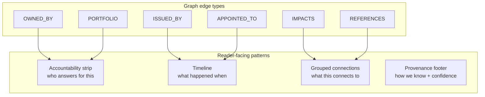

# Specification: Reader-facing relationship UI

> Status: **Proposed.** Design spec for restructuring how graph-derived linkages
> (`lib/graph.ts`) are surfaced to readers. The graph query layer is the source
> of truth for _what_ relationships exist; this document is the source of truth
> for _how_ they should be presented. The implemented knowledge graph is
> specified in [`knowledge-graph.md`](./knowledge-graph.md) — when this file
> proposes a new edge/query, that file must be updated when it ships.

## 1. Problem

The graph (`lib/graph.ts`) is a solid query engine over the entities. The
reader-facing UI built on top of it is not. Two primitives carry every
relationship:

| Primitive            | Component                            | Appears on                                                            |
| -------------------- | ------------------------------------ | --------------------------------------------------------------------- |
| Accountability chain | `components/AccountabilityChain.tsx` | KPI detail (`routes/kpi/[id].tsx`)                                    |
| Ego network (SVG)    | `components/EgoNetwork.tsx`          | Minister, Department, GO detail, orders index, appointment succession |

This produces six concrete reader problems:

1. **One visual pattern for many different questions.** `EgoNetwork` renders
   "who is accountable?", "what did this dept issue?", "who succeeded whom?",
   and "what does this order amend?" as the same left-to-right SVG. None of
   those questions is made obvious by the shared shape.
2. **Duplication without added clarity.** Most pages show the graph _and_ the
   same entities again as cards/lists (e.g. department page: `EgoNetwork` → KPI
   grid → `OrdersBrowser`). On GO detail, the list rows are strictly more
   informative than the SVG — they carry the `amends` / `supersedes` relation
   verb and notes the SVG drops.
3. **Weak links presented like strong ones.** Causal-feeling sections
   (`IMPACTS`) sit beside explicitly non-causal ones (`ISSUED_BY`) as two
   similar link lists. The distinction is correct in the data but invisible in
   the UI.
4. **A structural query bug undermines trust.** `getKpiLineage`
   (`lib/graph.ts:155`) reads `IMPACTS` edges _into_ the KPI
   (`getNeighborsByType(kpiId, "IMPACTS", "in")`), but `IMPACTS` is only ever
   written as `government_order → manifesto_goal` (`orderEdges`,
   `lib/graph.ts:402`; vocabulary in
   [`knowledge-graph.md` §3](./knowledge-graph.md)). So `impactingOrders` is
   **always empty** — the KPI page promises a causal hop the data model does not
   provide.
5. **Mobile / accessibility friction.** `EgoNetwork` is a fixed-width SVG with
   truncated labels that horizontal-scrolls on phones, and encodes relation
   meaning in colour dots that mirror KPI status tone — a confusing secondary
   encoding on, e.g., GO citation edges.
6. **Inconsistent naming and provenance.** Section titles vary ("Department
   map", "Portfolio map", "How this order connects"). Machine-extraction
   disclaimers appear on GO detail and appointments but not on minister/dept
   maps or KPI co-movement lists. `manifestoConfidence` is surfaced on the
   manifesto page but nowhere else a graph link appears.

## 2. Principle — question-first, honest strength

Readers do not want topology. They want **labelled answers with honest strength
indicators**. Every surfaced relationship answers a reader question and carries
its relationship type and (where available) confidence. The framing per entity:

| Entity        | Primary reader questions                                                                     | Strength of the links                                                                                               |
| ------------- | -------------------------------------------------------------------------------------------- | ------------------------------------------------------------------------------------------------------------------- |
| KPI           | Who is accountable? What's the official source? Did government action relate to this number? | **Strong:** source, owner dept, minister. **Medium:** manifesto-backed GOs. **Weak:** same-dept GOs in same period. |
| GO            | Who issued it? Which promise does it serve? What does it amend/cite?                         | **Strong:** PDF, dept tag. **Medium:** manifesto link (+confidence), `REFERENCES` verb.                             |
| Minister/Dept | What portfolios / KPIs / recent orders?                                                      | **Strong:** structural ownership. **Weak:** volume of activity.                                                     |
| Appointment   | Who holds what now? Who succeeded whom?                                                      | **Strong** when tied to a source GO (`EVIDENCED_BY`).                                                               |

## 3. Four reusable patterns

Replace the one-size-fits-all graph with four patterns, each mapped to a
question type and a set of edge types.



### Pattern A — Accountability strip (refine existing)

Keep `AccountabilityChain` at the top of the KPI page (optionally GO). It is
already scannable, bilingual, and mobile-friendly. Refinements:

- Show **designation** where known (Minister now; Principal/Secretary when
  `Secretary` data lands — see CLAUDE.md "Not yet implemented").
- Source link opens externally with a consistent icon.
- Reuse on `KpiCard` as a one-line "Accountable: Finance · Minister X" linking
  to the full strip on detail.

### Pattern B — Timeline (new component)

A vertical, date-sorted timeline when **time** is the organizing axis. Reads
naturally on mobile and replaces the succession `EgoNetwork`.

- **KPI page:** merge time-series points + manifesto-backed GOs (+ optionally
  same-dept GOs) into one chronological stream, each row tagged: _Data point_ /
  _Promise-backed action_ / _Same department (not a proven link)_.
- **Appointment succession:** Dept → Office → holders as a vertical timeline
  (oldest → newest), not a three-column SVG.
- **GO page (optional):** "In context" timeline of `REFERENCES`-related orders
  by date.

### Pattern C — Grouped "Connections" list (replaces most `EgoNetwork`)

One section, grouped by relationship type; each row = label + badge + link.

```
Connections
├── Accountable department   Finance Dept
├── Backs these promises     ✦ Free bus travel   [Direct · machine-tagged]
├── Amends                   G.O.(P) 98/2026/Fin
├── Cited by (2)             …
└── Indicators this dept owns  Debt-to-GSDP · Revenue deficit
```

Use on GO detail, minister, department. The existing GO-detail list is already
the right shape — **promote it to primary and drop the redundant SVG**. For
minister/dept, a nested list (portfolio → KPIs under each) beats a graph because
labels are not truncated and status badges sit inline.

### Pattern D — Provenance footer (consistent)

Every auto-linked block gets the same footer, plus per-link confidence where
available (`manifestoConfidence`, `deptConfidence`):

> Links are machine-detected from ingested PDFs · may be incomplete · verify
> against source

The manifesto page (`routes/gov/manifesto…`) already has this vocabulary — it is
the reference implementation. Align everything else to it.

## 4. Page-by-page restructure

### KPI detail (`routes/kpi/[id].tsx`)

1. Hero (value, trend, status, goal, comparators) — unchanged.
2. **Accountability strip** (Pattern A).
3. Definition + provenance card.
4. **Timeline** "Policy & data around this indicator" (Pattern B) — requires the
   KPI↔promise bridge in §5; overlay actual time-series points on the same axis.
5. **Collapsed** "Same department, same period" (`getKpiDepartmentOrders`,
   `lib/graph.ts:232`) — hidden by default, strong disclaimer. The function is
   already documented as administrative association, not causation; the UI must
   match.
6. **Remove** the empty "Decisions affecting this metric" section until the
   query in §5 is fixed.

### GO detail (`routes/gov/orders/[id].tsx`)

1. Title, type, date, PDF CTA — unchanged.
2. **Connections grouped list** (Pattern C) — dept, manifesto goals with
   confidence, cites, cited-by.
3. **Remove** `EgoNetwork` (or demote to a `<details>` "Overview map").
4. Bilingual subject + summary + provenance — unchanged.

### Minister / Department (`routes/gov/ministers/[slug].tsx`, `routes/gov/departments/[slug].tsx`)

1. Identity header — unchanged.
2. Portfolios / KPIs / recent orders as structured lists (Pattern C, primary).
3. **Remove** `EgoNetwork`.
4. Optional compact stats row ("12 KPIs · 47 orders this term") from graph
   counts.

### Appointments (`islands/AppointmentsBrowser.tsx` + succession)

Replace tenure `EgoNetwork` blocks with **office succession timelines per
department** (Pattern B). Keep `AppointmentsBrowser` as the searchable index.

### Manifesto

Already closest to the target model (goal → backing GOs with confidence). Treat
as the reference; align other pages to its linkage UI.

## 5. Data-model adjustments (so the UI's claims are honest)

The restructure only holds if graph queries match reader claims:

| UI claim                 | Needed graph path                           | Status     |
| ------------------------ | ------------------------------------------- | ---------- |
| "Backs a promise"        | `GO -IMPACTS→ ManifestoGoal`                | ✓ exists   |
| "Relates to this metric" | `GO → ManifestoGoal → KPI` join (see below) | **needed** |
| "Same department"        | `KPI -OWNED_BY→ Dept ←ISSUED_BY- GO`        | ✓ exists   |
| "Who is accountable"     | `KPI -OWNED_BY→ Dept ←PORTFOLIO- Person`    | ✓ exists   |
| "Amends / supersedes"    | `GO -REFERENCES→ GO`                        | ✓ exists   |

### Fixing the KPI↔GO hop (problem #4)

`ManifestoGoal` (`data/types.ts:425`) has **no** KPI back-reference today, and
`IMPACTS` lands on the goal, not the KPI. Two options, in preference order:

- **Option A — curated bridge (recommended).** Add `relatedKpiIds?: string[]` to
  `ManifestoGoal`. Rewrite `getKpiLineage` to traverse
  `KPI ← (relatedKpiIds) ← ManifestoGoal ←IMPACTS- GO`, returning GOs grouped as
  **"Government orders backing related promises"** (routed through the goal —
  not a direct GO→KPI causal claim). Curated and defensible; no extractor
  change.
- **Option B — extractor edge.** Have ingest tag a `SUPPORTS` / `RELATES_TO`
  edge `GO → KPI` with confidence when the PDF clearly targets an indicator.
  More automatic, lower precision; only if Option A's curation proves too
  costly.

Either way, **until the bridge ships the KPI page must not imply direct GO→KPI
causation** — the section is "backing related promises", routed through
manifesto, never "decisions affecting this metric".

Adopting Option A is a graph-vocabulary change: update
[`knowledge-graph.md`](./knowledge-graph.md), bump `SEED_VERSION`
(`data/db.ts`), and add a `lib/graph_test.ts` projection test (per the extension
recipe in that spec §4).

## 6. Component architecture

Consolidate into a small set of **server** components (islands only where
interactivity is required):

| Component             | Role                                                                      |
| --------------------- | ------------------------------------------------------------------------- |
| `AccountabilityStrip` | Rename/refine existing `AccountabilityChain`.                             |
| `ConnectionGroups`    | `{ title, groups: { label, badge?, href, confidence?, disclaimer? }[] }`. |
| `EventTimeline`       | Date-sorted rows with type chips.                                         |
| `AutoLinkDisclaimer`  | Shared provenance footer (Pattern D).                                     |
| `ConfidenceBadge`     | Extract from the manifesto page; reuse everywhere a link appears.         |

Backend: expand `getKpiLineage` into a `getKpiConnections` that returns one
struct grouped by relationship kind, per the "assemble one struct per page"
guidance in [`knowledge-graph.md` §6](./knowledge-graph.md) — components render,
they don't traverse.

`EgoNetwork` is **retired from the default citizen surface**; keep it only as an
optional diagnostic (`<details>` or admin).

## 7. Bilingual & provenance invariants

Unchanged from the project invariant: every label carries its `*Ml`, components
select on `state.lang`, and machine-drafted links keep their caveat. Pattern D
makes the provenance disclaimer mandatory and uniform across every graph-derived
block — it must not be droppable.

## 8. Sequencing

1. **Fix #4 first** (data-model §5 Option A) — highest-trust, smallest change;
   unblocks the KPI timeline.
2. Build the four shared components (§6).
3. Migrate pages in order: KPI detail → GO detail → minister/dept →
   appointments.
4. Retire `EgoNetwork` from default surfaces once each page is migrated.
5. Run `deno task check` + `deno task check:ml` + `deno task test` before each
   PR (per CLAUDE.md gates).

## 9. Out of scope

- New ingest/extraction work beyond the optional §5 Option B edge.
- `Constituency` / `MemberOfLegislative` / `Secretary` data (not yet
  implemented) — the strip should _accommodate_ designation when it lands, not
  block on it.
