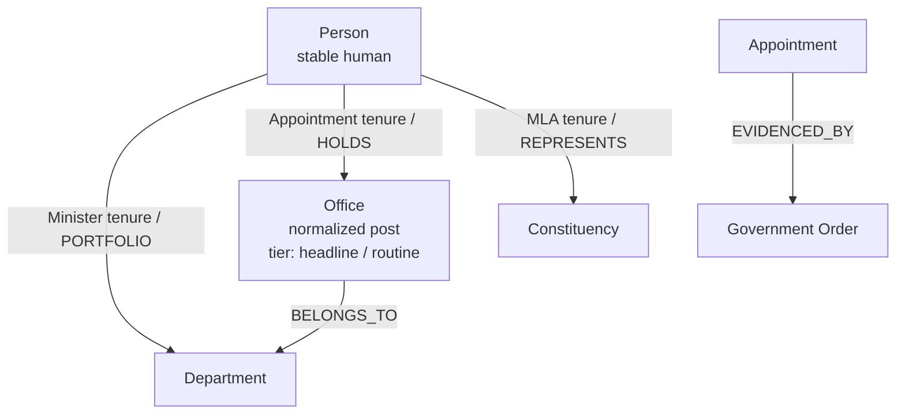

# Specification: Person spine, Office normalization, and reader-first appointments

> Status: **Proposed.** This is the **entity-model** companion to
> [`graph-ui-relationships.md`](./graph-ui-relationships.md). That spec governs
> _how_ graph-derived links render (accountability strip, timeline, grouped
> connections, provenance footer) and explicitly puts Person / Office /
> Secretary **out of scope** (§9). This document fills that gap: it specifies
> the missing entities and the reader-first surfaces (Person hub, department
> "who runs this", banded appointments) that the presentation patterns then
> render.
>
> The graph model it touches is specified in
> [`knowledge-graph.md`](./knowledge-graph.md); the entity model in
> [`docs/data/data-model.md`](../data/data-model.md). Both must be updated when
> any edge/type here ships.

## 1. Problem — appointments are ingest artifacts, not governance entities

The minister pattern is built correctly: `Person` is the stable node, `Minister`
is a dated tenure on it (`PORTFOLIO` edge → department), and minister/department
pages render that tenure with KPIs and provenance. Appointments reimplemented
the _same idea_ as orphaned Government-Order lines:

| Layer            | Ministers (the model)              | Appointments (today)                                 |
| ---------------- | ---------------------------------- | ---------------------------------------------------- |
| Primary entity   | `Minister` tenure on `Person`      | `Appointment` row per GO line                        |
| Person page      | `/gov/ministers/[slug]`            | none — `personId` shows a ★ with **no link**         |
| Department page  | minister card + KPIs               | "Pending" for secretary; no current PS shown         |
| Graph hub        | `Person -PORTFOLIO-> Dept`         | `Appointment -APPOINTED_TO-> Dept` (person optional) |
| Curated/inferred | hand-verified fixtures             | all machine-extracted, one flat list                 |
| Significance     | rank (`CM` / `Deputy CM` / member) | `officeKey()` string heuristic, no tier              |

`Appointment` is **already tenure-shaped** (`termStart` / `termEnd` / `branch` /
`action` / `personId`, `data/types.ts:607`) — so this is **not** a call to
introduce a parallel `GovernmentPost` entity. The gaps are narrower:

1. **No normalized office.** `Appointment.office` is free text
   (`"Principal Secretary (Finance)"` and every spelling variant). Without a
   stable office identity there is no succession line ("who held this chair
   before?") and no place to attach a significance tier.
2. **`personId` dead-ends.** A confident match sets `personId`, the graph emits
   an `APPOINTEE` edge — and the UI shows a ★ that links nowhere. There is no
   Person page to merge a human's minister tenure, postings, speeches, and MLA
   record.
3. **Everything is equally loud.** A Principal Secretary (Finance) posting and a
   batch university-VC extension sit in the same accordion with the same weight.
   Importance is a property of the **office**, not of the GO row — but offices
   are not modelled, so there is nowhere to record it.
4. **`Secretary` is snapshot-shaped, not tenure-shaped.** It carries
   `designation` + `departmentIds[]` + `appointedOn?` (`data/types.ts:343`) — no
   `termStart` / `termEnd`, so it cannot supersede or show history, and it is
   disconnected from the appointment stream that already names the current PS.
5. **MLA / Constituency typed but empty.** `Constituency` and
   `MemberOfLegislative` are fully defined (`data/types.ts:166`, `:185`) with no
   data and no graph projection, so a minister page cannot say "also MLA for
   Dharmadam".

## 2. Principle — one Person spine, many dated tenures, offices as the unit of importance

Finish the entity model already in flight; do **not** build a parallel "persona
DB". Three moves:

- **Person is the only identity.** Minister, Speaker, MLA, and
  bureaucratic/board/ judiciary postings are all dated tenures that point at a
  Person. The reader hub is the Person, not the GO.
- **Office is the normalized post** and the carrier of significance. Importance
  (headline vs routine) lives on the office, set by human review — never
  inferred from GO type per row.
- **Appointment stays the ingest evidence + the tenure record**, gaining an
  `officeId` FK once normalized. Provenance (`EVIDENCED_BY` → GO) is preserved
  unchanged.



## 3. Entity changes

### 3.1 New: `Office` (normalized position)

One record per real post — not per spelling variant of its title.

```ts
export interface Office {
  id: string; // office.ps-finance, office.vc-ku
  slug: string;
  title: string; // "Principal Secretary (Finance)"
  titleMl?: string;
  branch: AppointmentBranch; // reuse existing union
  deptId?: string; // FK → Department (bureaucratic/executive)
  court?: string; // judiciary
  /** headline = show on dept/person pages & "Key offices"; routine = search-only. */
  tier: "headline" | "routine";
  /** Free-text office strings ingest maps onto this office (exact / curated alias). */
  aliases?: string[];
  dataStatus: "verified" | "unverified" | "tbd";
}
```

- **Tier is set by review, never inferred per row.** An office graduates to
  `headline` only when a human (or admin) verifies it. Default for an
  ingest-discovered office is `routine`.
- Ingest maps `Appointment.office` → `officeId` via a **curated alias table +
  high-confidence exact match only**. No fuzzy guess may land a `headline` tier.
  An unmapped office string keeps `officeId` undefined and the row stays in the
  "all ingested" band — never lost.

### 3.2 `Appointment` gains `officeId` (additive, non-breaking)

```ts
/** FK → Office.id — set when the free-text office is normalized; optional. */
officeId?: string;
```

`office` / `officeMl` free text remain (raw extraction + fallback display). No
existing field changes, so re-extraction stays idempotent.

### 3.3 `Secretary` → reshape toward tenure, or deprecate

`Secretary` (`data/types.ts:343`) duplicates what an `Appointment` +
`bureaucratic` `Office` already expresses, minus the dates. Two options, in
preference order:

- **Option A — deprecate `Secretary` (recommended).** The current Principal/
  Additional Secretary is just the open (`termEnd === undefined`) `Appointment`
  whose `Office.tier === "headline"` and `Office.deptId === <dept>`. No second
  type; the department page reads it from the graph. Pick this unless a curated,
  non-GO secretary roster is needed.
- **Option B — reshape `Secretary` into a tenure** (`termStart` / `termEnd`,
  `officeId`) if hand-curated bureaucratic rosters must coexist with ingested
  ones. More code; only if Option A's coverage proves insufficient.

Either way, the department page stops showing a hardcoded "Pending".

### 3.4 MLA / Constituency — seed the existing types

No type changes. Seed `Constituency` (140, ECI Delimitation Order) and
`MemberOfLegislative` (15th KLA, CEO Kerala / ECI results), then project both
into the graph (§4). This unlocks the electoral section on the Person hub.

## 4. Graph projection

Per the extension recipe in [`knowledge-graph.md` §4](./knowledge-graph.md) —
extend `GraphNodeType` / `GraphEdgeType`, add pure builders, a `sync*`, wire
`buildGraph()`, bump `SEED_VERSION`, add a `lib/graph_test.ts` projection test.

### New node type

| type     | entity   | builder      |
| -------- | -------- | ------------ |
| `office` | `Office` | `officeNode` |

(`constituency` only if constituency pages are built; the MLA edge can target a
`person`→`constituency` pair without a constituency _node_ if pages aren't
needed yet.)

### New edge types

| type         | source → target       | meaning / properties                     |
| ------------ | --------------------- | ---------------------------------------- |
| `HOLDS`      | person → office       | display tenure; `{termStart, termEnd}`   |
| `BELONGS_TO` | office → department   | which department an office sits in       |
| `REPRESENTS` | person → constituency | MLA tenure; `{termStart, termEnd, term}` |

**Reuse the active-holder convention**
([`knowledge-graph.md` §3](./knowledge-graph.md)): `HOLDS` / `REPRESENTS` carry
`termStart` / `termEnd`; `termEnd === undefined` = current holder. The existing
`APPOINTED_TO` / `APPOINTEE` / `EVIDENCED_BY` edges on `Appointment` **stay** —
they are the provenance/audit layer. `HOLDS` is the **display** edge derived
from the appointment once its office is normalized:

```
Appointment (personId set, officeId set, termEnd undefined)
  ⇒ HOLDS: person -> office   (display)
  ⇒ EVIDENCED_BY: appointment -> GO   (provenance, unchanged)
Office.deptId ⇒ BELONGS_TO: office -> department
```

So a department's current holders =
`active BELONGS_TO into dept → office (tier headline) ← active HOLDS ← person`.

### Gotcha to respect

`sync*` adds an edge only when its target node already exists
([`knowledge-graph.md` §4 gotcha](./knowledge-graph.md)). Offices must be
projected **before** `HOLDS` edges, and re-hydrated before `buildGraph()` if
they get a durable mirror. Emit `HOLDS` only when both `personId` and `officeId`
are set — a missing FK ⇒ no edge, not a dangling one.

## 5. Reader-first surfaces

These reuse the **presentation patterns** from
[`graph-ui-relationships.md` §3](./graph-ui-relationships.md) —
`ConnectionGroups`, `EventTimeline`, `AutoLinkDisclaimer`, `ConfidenceBadge` —
rather than inventing new ones.

### 5.1 `/gov/people/[slug]` — the Person hub (new)

One page per Person, sections by role, each sourced from open/closed tenures:

| Section         | Source                                                               | Pattern            |
| --------------- | -------------------------------------------------------------------- | ------------------ |
| Current roles   | open tenures: Minister, headline `HOLDS`, MLA, Speaker               | `ConnectionGroups` |
| Career timeline | all dated tenures merged (not a GO list)                             | `EventTimeline`    |
| Evidence        | source GO per tenure change                                          | provenance links   |
| Speeches        | `PublicSpeech` by `personId` — **moved here** from the minister page | (existing)         |

The **minister page becomes a view** over Person + the current minister tenure,
not a separate identity. The ★ on a matched `personId` (appointments, minister
cards) now links here. _A "matched to a known person" badge with no link is
worse than no badge — routing it here is the fix._

### 5.2 Department page — "Who runs this"

Replace the hardcoded secretary "Pending" with graph-derived current holders:

```
Accountable minister   [linked person]                 (active PORTFOLIO)
Principal Secretary    [linked person]  since 2024-03-15  [GO ↗]
Head of Department     [linked person]  since …            [GO ↗]
Other postings (N)     [collapsed — routine tier only]
```

Query: active `PORTFOLIO` into the dept + active `HOLDS` whose office
`BELONGS_TO` the dept **and** `Office.tier === "headline"`. Routine-tier holders
collapse into the "Other postings" disclosure.

### 5.3 Appointments tab — three bands, not one flat list

Restructure `/gov/appointments` (`islands/AppointmentsBrowser.tsx`) into bands
by significance, not a single browser:

| Band                  | Content                                               | Default   |
| --------------------- | ----------------------------------------------------- | --------- |
| Key offices now       | headline-tier current holders, grouped by dept/office | open      |
| Recent changes        | last 90 days, headline tier only, `EventTimeline`     | open      |
| All ingested postings | current `AppointmentsBrowser`, machine-draft banner   | collapsed |

Row linking (consistent across bands):

- **Name** → `/gov/people/[slug]` when `personId` set; else the appointment
  detail.
- **Office** → `/gov/offices/[slug]` (current holder + succession), once offices
  ship.
- **Department** → department page.
- **GO** → order detail as **provenance**, not the primary click target.

### 5.4 Appointment detail — tenure card, not a field dump

Lead with the tenure, demote the GO to provenance:

```
K. M. Mohammed Hanish · Principal Secretary (Finance)
Took charge 15 Mar 2024 · Current
[View person profile]  ·  [Finance department]
— source GO + sibling appointments below —
```

### 5.5 Office hub `/gov/offices/[slug]` (with §3.1)

Current holder + an office succession `EventTimeline` (oldest → newest), each
change carrying its source GO. This is the office-centric counterpart to the
person-centric career timeline, and the target of "Office →" row links.

## 6. Significance tier — the concrete rule

Importance lives on `Office.tier`, set by **human review**, not on any per-row
heuristic:

| Tier       | Examples                                                                        | Where it shows                                         |
| ---------- | ------------------------------------------------------------------------------- | ------------------------------------------------------ |
| `headline` | CM, ministers, PS / Addl. CS / Secretary, HoD, HC Registrar, major board chairs | dept page, person hub, "Key offices now"               |
| `routine`  | extensions, minor boards, batch posting lists, deputations                      | "All ingested" band only, always machine-draft-flagged |

Promotion path: review (or the admin area) flips an office to `headline` once
verified. Ingest may **create** offices (as `routine`,
`dataStatus: "unverified"`) but may never **promote** one.

## 7. Phased build (minimal churn, each phase shippable)

| Phase | Scope                                                                                                                     | New entities | Graph change                    |
| ----- | ------------------------------------------------------------------------------------------------------------------------- | ------------ | ------------------------------- |
| 1     | `/gov/people/[slug]` aggregating Minister + matched appointments; fix all `personId` ★ links; move speeches               | none         | none (read existing)            |
| 2     | `Office` + alias map; `Appointment.officeId`; `HOLDS` / `BELONGS_TO`; dept "Who runs this"; deprecate/reshape `Secretary` | `Office`     | `office`, `HOLDS`, `BELONGS_TO` |
| 3     | Seed `Constituency` (140) + 15th-KLA `MemberOfLegislative`; `REPRESENTS`; electoral section on Person hub                 | data only    | `REPRESENTS`                    |
| 4     | Appointments tab three-band restructure; `/gov/offices/[slug]`; demote flat browser                                       | none         | none                            |

**Phase 1 is the highest-leverage step** — a Person hub + fixed links with **no
new entities and no `SEED_VERSION` bump**, purely aggregating data already in
KV. It is independently shippable and makes the existing `APPOINTEE` matches pay
off immediately.

## 8. Invariants & gates (unchanged)

- **Bilingual:** every new label (`Office.title`/`titleMl`, section headers)
  carries its `*Ml`; components select on `state.lang`. Ingested offices /
  appointments stay `translationStatus: "machine-draft"`,
  `dataStatus: "unverified"` until reviewed
  ([`bilingual-localization.md`](./bilingual-localization.md)).
- **Provenance never laundered:** machine-drafted holders render with the
  `AutoLinkDisclaimer` footer; tier `routine` rows keep the machine-draft
  banner.
- **Graph is a derived projection:** offices/`HOLDS`/`REPRESENTS` rebuild from
  fixtures + durable mirrors on every `SEED_VERSION` bump
  ([`knowledge-graph.md` §1](./knowledge-graph.md)).
- **Gates:** bump `SEED_VERSION` (`data/db.ts`) for any fixture-shape change
  (Phases 2–3); add the new prefixes to the `seed()` wipe list; run
  `deno task check` + `deno task check:ml` + `deno task test` before each PR.

## 9. Out of scope

- Auto-creating `Person` records from ingest — a name is matched to an existing
  Person only on a confident match (`data/types.ts:602`); unmatched appointees
  stay text-only.
- Auto-promoting an office to `headline` from GO type or extractor confidence —
  promotion is always a human/admin action (§6).
- The presentation-layer restructure (KPI timeline, GO connections, retiring
  `EgoNetwork`) — owned by
  [`graph-ui-relationships.md`](./graph-ui-relationships.md).
